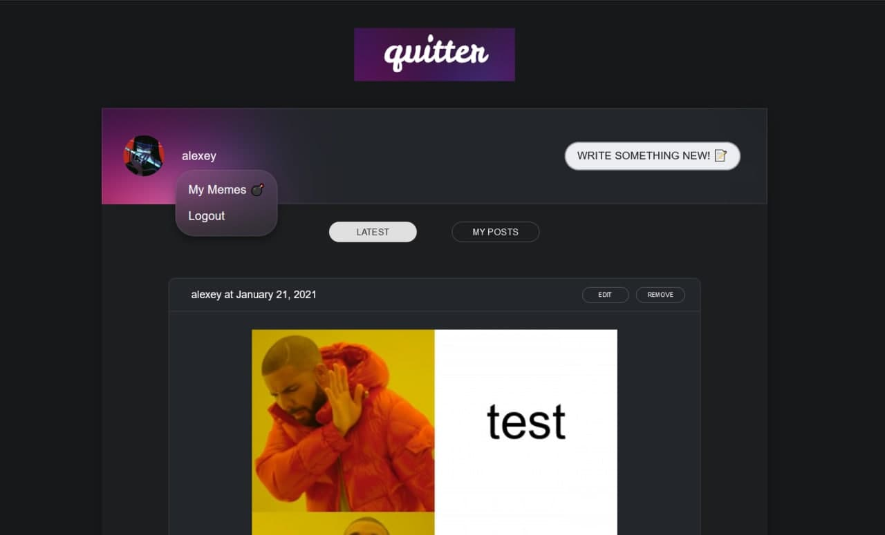

# QUITTER ReactJS App

Microblogging application developed using React, Firebase, Imgflip API and LanguageTool API.

### Requirements:
1. Define Credentials, Firebase values and LanguageTool API server URL in ```.env.development``` or ```.env.production```:

```js
REACT_APP_IMGFLIP_USERNAME=[placeholder]
REACT_APP_IMGFLIP_PASSWORD=[placeholder]

REACT_APP_LANG_TOOL_BASE_URL=http://example.com/api

REACT_APP_API_KEY=[api key]
REACT_APP_AUTH_DOMAIN=[auth domain]
REACT_APP_PROJECT_ID=[project Id]
REACT_APP_STORAGE=[storage]
REACT_APP_SENDER_ID=[sender]
REACT_APP_APP_ID=[app Id]
REACT_APP_MRMT_ID=[measurement Id]
```

2. Install NPM packages ```npm install```
3. Before application <i>start</i> define bindings for Facebook OAuth and Github OAuth from specific consoles and firebase console.
3. Start application ```npm start```

### App screenshot:




<br>

Developed by [swrd1337](https://github.com/swrd1337)